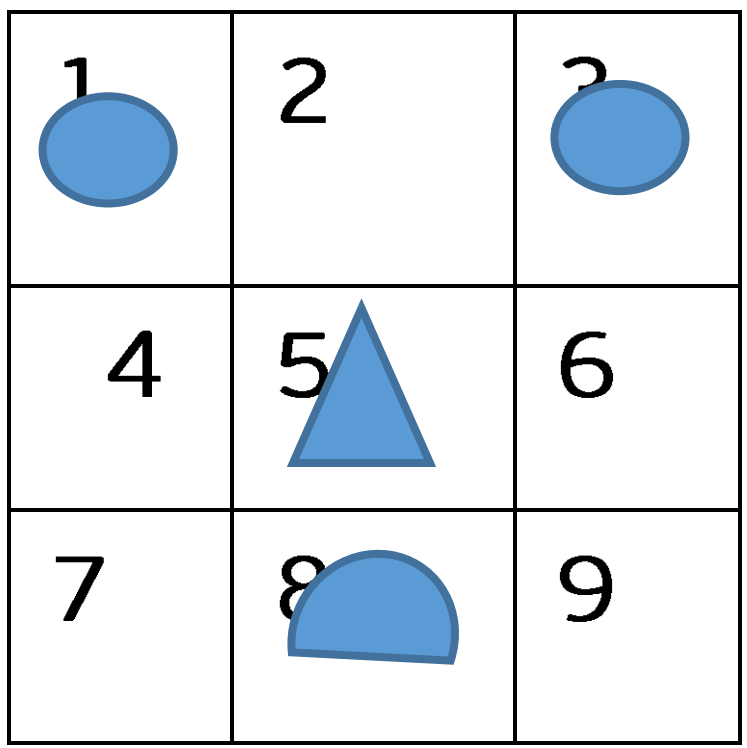
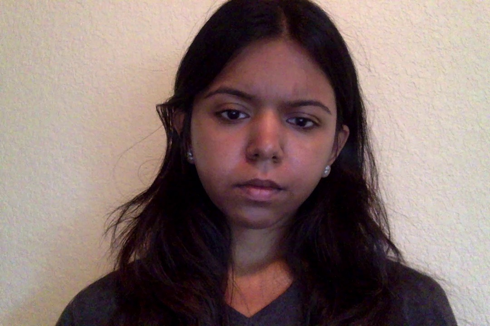
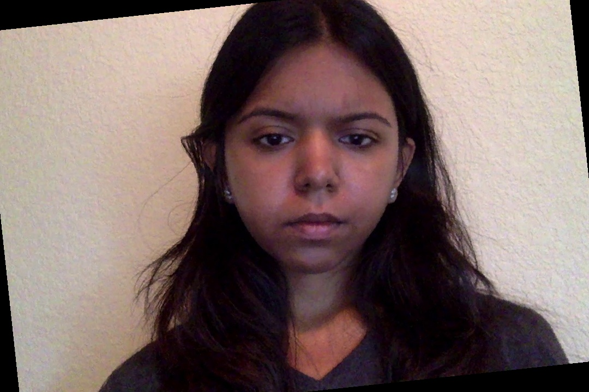
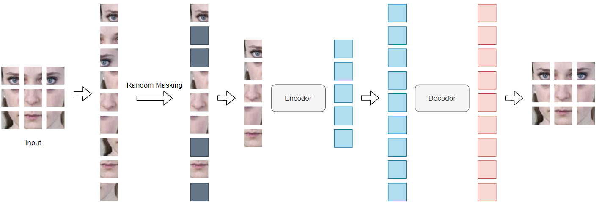
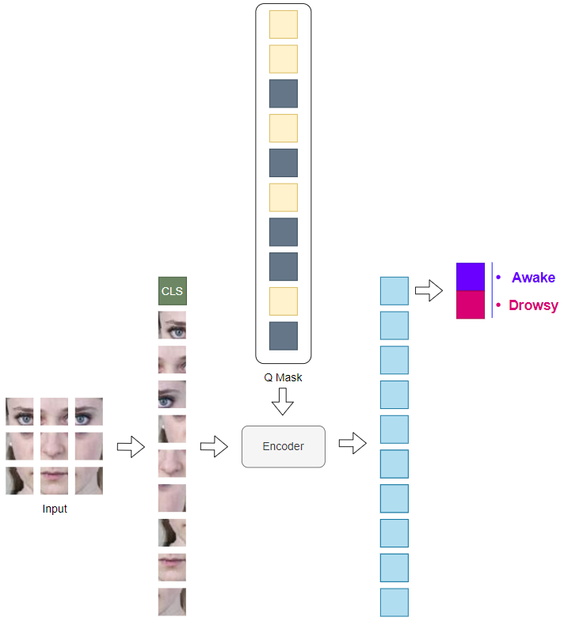
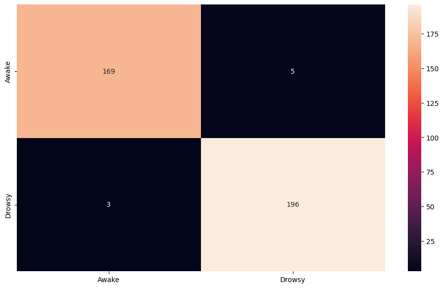

# vit-masked-auto-encoder

## Motivation and Overview

In several fields nowadays, automated emotion recognition has been shown to be a highly powerful tool. Mapping different facial expressions to their respective emotional states is the main objective of facial emotion recognition (FER). Previously, approaches to this problem were based on the whole face image and based on landmarks. Both approaches do not solve the problem of missing, tilted, distorted faces.

When looking at a human face, we often pay attention to 4 main points: eyes (left eye, right eye), nose and mouth. However, we do not always see these 4 points at the same time because the face can be obscured, tilted, making it difficult to identify emotions. Assume the input face image is divided into 9 parts as shown in Figure 1, in which: part 1 contains left eye, part 3 contains right eye, part 5 contains nose and part 8 contains mouth. In this study, we applied various deep learning methods and pretrained model to identify the key two human emotions: tired and awake.

## Dataset: UTA Real-Life Drowsiness Dataset

Comprises 30 hours of videos featuring 51 men and 9 women from diverse ethnicities and age groups, categorized into three classes: alert, low vigilant, and drowsy.
To prepare our dataset for our model we extracted frames from the videos and then applied a series of image processing techniques including face alignment, cropping, and scaling. These steps resulted in a dataset of 1845 images labeled as ”awake” and 1888 images labeled as ”drowsy”.

|          Raw          |          Alignment           |          Final          |
| :-------------------: | :--------------------------: | :---------------------: |
|  |  |  |

## Proposed Method

-   Mask Autoencoder Pretraining

    1. The face image is split into patches for capturing local features.
    2. Random masking is applied to the patches to recognize unique features.
    3. An encoder extracts relationships between patches, and a decoder reconstructs the images for iterative learning of face detection.
       

-   Classifier Training 1. The encoder’s Q mask helps the transformer focus on special landmark boxes of the face. 2. [CLS] token captures global context and helps with a holistic understanding among patches. 3. Classification head transforms encoded feature into probability distribution to predict drowsy/awake state based on the input image
    

## Experimental results

In this section, we present the results of our experiments on the proposed method. We evaluate the performance of our method on the UTA Real-Life Drowsiness Dataset. We use metrics such as accuracy, f1_score, precision, and recall to mea- sure the quality of our method. We also show the validation loss of the model.

| Metrics      | Results |
| ------------ | ------- |
| Accuracy     | 0.9544  |
| F1_score     | 0.9534  |
| Precision    | 0.9579  |
| Recall       | 0.9503  |
| Testing Loss | 0.1357  |

This section also presents the confusion matrices for our classification models. A confusion matrix is a table that shows how well a model can predict the actual labels of the test data. By using a confusion matrix, we can evaluate the accuracy, precision, recall, and other metrics of our models. We can also identify the types of errors that our models tend to make and how to improve them

